# 5/23: Research & a bit of schematic work

I settled on my idea (a watch powered by a lipo battery with an e-paper display and wireless connectivity to automatically fix time). Since I don't know too much about hardware design asides from super sanitized tutorials, I needed to do some research regarding these things. Looking at footprints in KiCad and photos online, the ESP32 S3 Mini 1 made more sense than the regular ESP32 WROOM for its size. The RP2040 initially looked more convenient but I really wanted that WiFi connectivity for automatic time correction and possibly some weather prediction features. I thought that using the bare chip was also better because it allowed me to connect the data right to the microcontroller while charging the battery that will be powering the rest of the device (at least that's how I'm hoping it will work.) I'm also planning on using a 1.54 inch e-paper display, but I'm trying to avoid using any driver boards to keep the device compact. While doing research, I set up some of the components in KiCad and wired some basic things together (a few wires, and the boot & reset buttons). The debug buttons had to use a pull-down resistor (which I learned about because of the schematic at https://diy.viktak.com/wp-content/uploads/2023/11/esp32-s3-mini-1-schematics.png, because i have NO idea about how to use this thing). I stopped at the battery circuit because that seemed too hard and I wanted to take a break. Afterward, I looked back a bit and did some more looking around at how to power the battery, landing on using a battery charger/power path management IC (but not after messing around with a battery charger WITHOUT power path management for a solid 30 minutes). I've gotten most of the basics done today so far. 

Lapses: https://lapse.hackclub.com/timelapse/2YLNZjLKJ49O, https://lapse.hackclub.com/timelapse/AwMG_Jw_1pwr

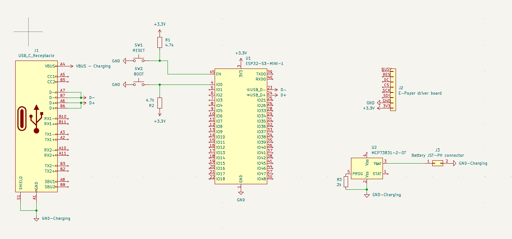

**Total time spent: 1.5 hours**

# 5/24: Pretty much finished up with the power circuit

I gave up on swapping that battery charger/power path management IC (too many pins and I don't wanna deal with that now) and kept the earlier IC (the MCP73831-OT) and instead added two Schottky diodes that would automatically complete the circuit using the source currently active (power supplied from the USB-C input or the battery). Idea was yoinked from some guy on Reddit who was responding to someone with the exact same issue that I had, and also put up the possible issue that the diodes would reduce the battery voltage below 3.3V and make it unusable, so I went through like 20 resistor datasheets one by one before just Googling a low power loss diode and landing on the currently used ones. Everything for the power should be wired up right, but I sent it to the hardware channel on the HC Slack just in case. I'll also start off the README with a BOM so I won't forget anything. Thanks to Kai Pereira on the Slack for helping me with a question about the e-paper thing, which I'll hopefully be doing tomorrow.

Lapse: https://lapse.hackclub.com/timelapse/NfazSZBNFMmf

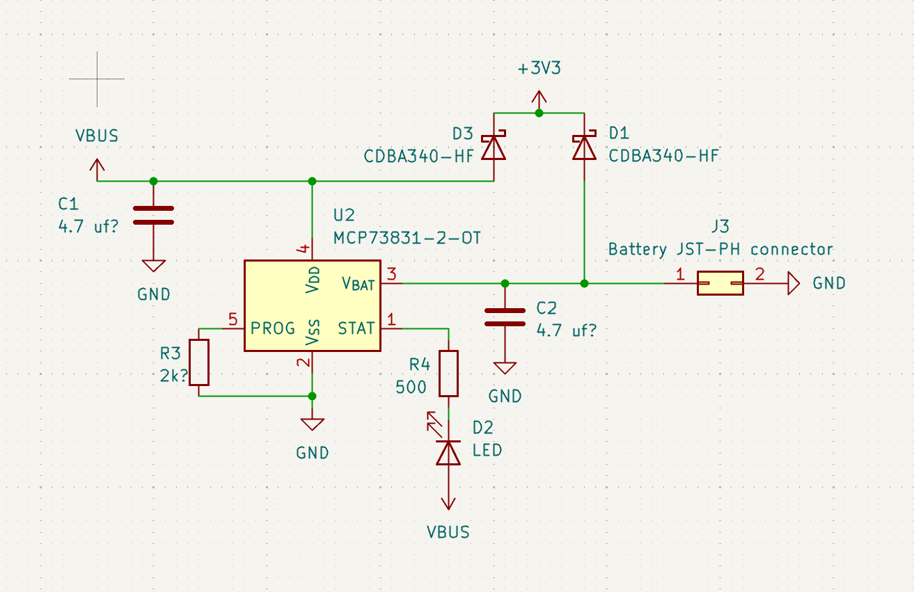

**Total time spent: 1 hour**

# 5/25: E-paper display driver essentially done, figured out that I need an RTC IC

I don't know how the e-paper drivers work, so I just shoved all of the main junk from the Waveshare e-paper driver HAT onto my PCB. Credits to them for the most part. Obviously, the compatibility switches were taken out because I only need one type of display. Also looked at Kai Pereira's Overglade badge to make sure that I really wasn't doing something stupid with this. It actually took a really long time to figure out exactly what pins to hook the data lines for the EPD to, because all of the ones on this ESP32 are named really confusing things (There were too many options and I didn't know what some were, just that they were SPI.) I also added an A & B button for controlling the watch and wired them to the two pins that weren't used in the middle of all of the currently used ones. The only thing left to do is get the real-time-clock thing settled, because I just realized that CircuitPython can't really keep track of time. I found a good IC for that, and I'll get it wired up tomorrow, if I don't have much schoolwork (which I shouldn't, because it's a party day.)

Lapse: https://lapse.hackclub.com/timelapse/eFtLpvhWv_lq

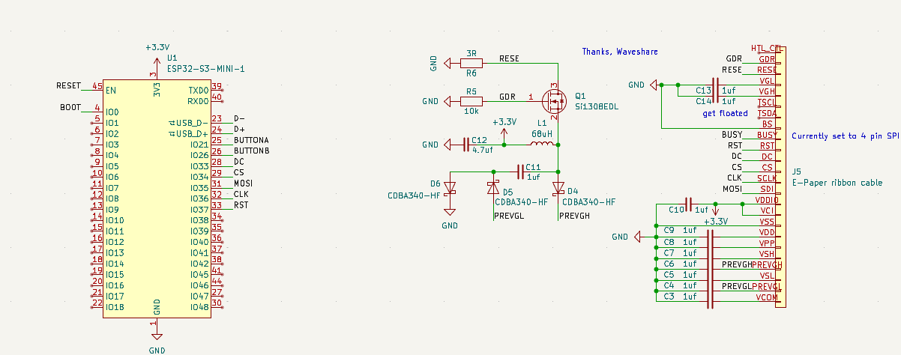

**Total time spent: 1.2 hours**

# 5/26: LDO added and some RTC connections

I didn't really have much time today due to some other tasks. yas on the #hardware channel looked over my power circuit and pointed out that I was trying to wire 5V directly to the 3V3, which would probably have blown up the entire thing. I fixed that with an LDO IC that's hopefully small enough. I could make it smaller but I chose a moderately larger one because KiCad doesn't have another footprint currently. I also got some of the RTC connections down and made sure that it was compatible with CircuitPython (don't wanna learn c yet). Weirdly enough, like half of the pins on the RTC IC need pull-up resistors, which I haven't seen before. I'll finish that tomorrow. I'm also going to update the BOM to include the new and smaller components. 

Lapse: https://lapse.hackclub.com/timelapse/BdzhmiEXduZc

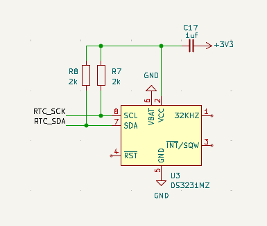

**Total time spent: 0.3 hours**

# 5/27: Finished with schematic, some footprint assigning

The schematic is finished! I need to review it and make sure it won't instantly explode but everything should be done! I finished the RTC connections and connected some IO pins to what will be a perfboard-like devboard thing because I don't want all of those microcontroller capabilities to go to waste. The footprints are going to be a pain but I've started assigning a few. The worst part so far is having to make an EasyEDA account to rip footprints off parts that aren't in KiCad's libraries. 

Lapse: https://lapse.hackclub.com/timelapse/oYHkt6sVn5RI

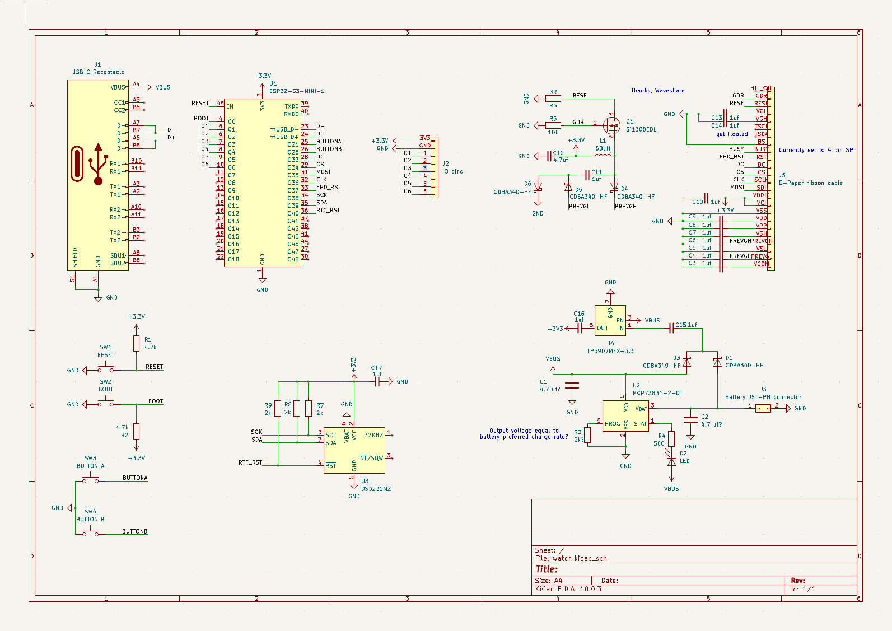

**Total time spent: 0.5 hours**

# 5/28: Just a tad bit of footprint assignment

No time today, and I wanted to keep my streak. I just assigned some more footprints today, tried to import a button footprint, and found a good one for all of the capacitors. Not much. No lapse because I didn't bother to make one.

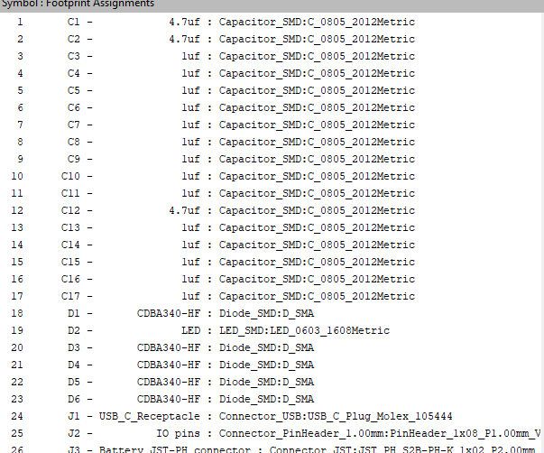

**Total time spent: 0.1 hours**

# 5/29: Footprint assignment finished and starting on PCB

End of year stuff's been going on, but I decided to pull some extra time to work. I actually finished all of the footprint assigning and started on the PCB! This is my favorite part, because I just need to think about placement and mindlessly wiring stuff together. I'll also need to write down those components because I am GOING to forget them. I still need to fix some components, such as choosing the wrong size for the IO pins and having a vertical USB-C plug instead of a horizontal USB-C receptacle, but I'll get to that tomorrow (during summer break YAYA). EVERY SINGLE LAST PIN on the 24-pin ribbon cable got detached because of pin value mismatch so I'm going to have to do that by hand later. I don't have a lapse today (was only going to make a small tweak but worked longer than I expected).

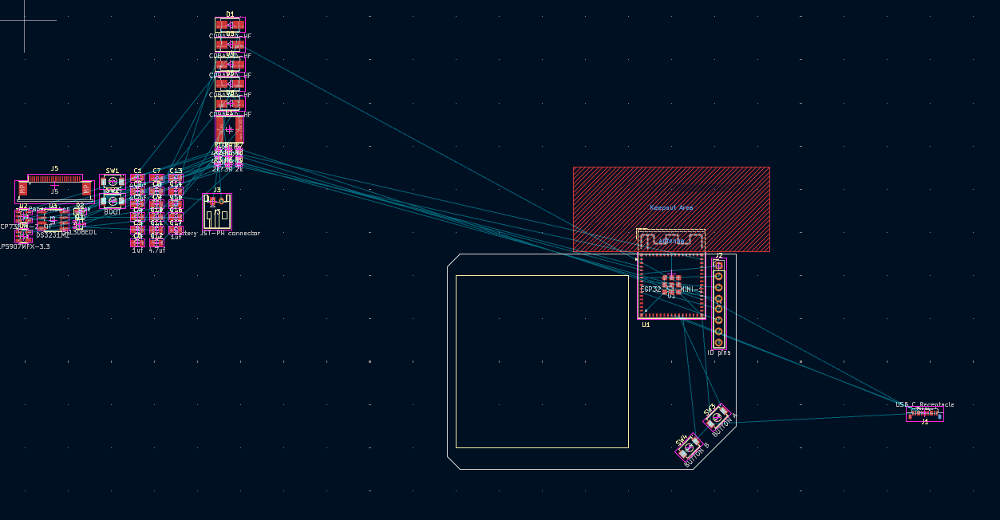

**Total time spent: 0.5 hours**

# 5/30: PCB routing *almost* finished!!!

I know it's 12:00 AM on 5/31, but let me have this one because I really like PCB routing and kinda zoned out while doing it. Anyway, I have now ALMOST FINISHED EVERYTHING!!!!! Everything except the reset and boot buttons have been placed and it looks good so far. I also had some more issues brought up (because I am extremely incompetent) and I got those fixed. I even printed out a 1:1 copy of it and the scale seems ok. I was initially going to add the holes for the wrist strap directly into the PCB, but I'm probably going to go with a printed case instead with the added benefit of more battery protection. I actually did not take into account how cramped this would be with the (relatively) enormous Schottky diodes. The back is left empty save for traces and vias on purpose because the battery's going there and I don't think it's a good idea. I'll probably have to squeeze the reset and boot buttons on there, but I already have an outline where the battery will be so it shouldn't be an issue getting around it. Routing is satisfying, but fitting everything is a headache. I actually contemplated rotating the microcontroller 180 degrees for some convenience before realizing that it would make a WHOLE lot of traces cross over each other and that isn't a good idea. Another challenge was getting around the large Schottky diodes, but it was pretty much fine after I gave up and shoved three of them under the e-paper display. After figuring out the boot button placement, it's just the silkscreens before I can move onto ordering and assembling. 

Lapse: https://lapse.hackclub.com/timelapse/GY0gmqQjs46F

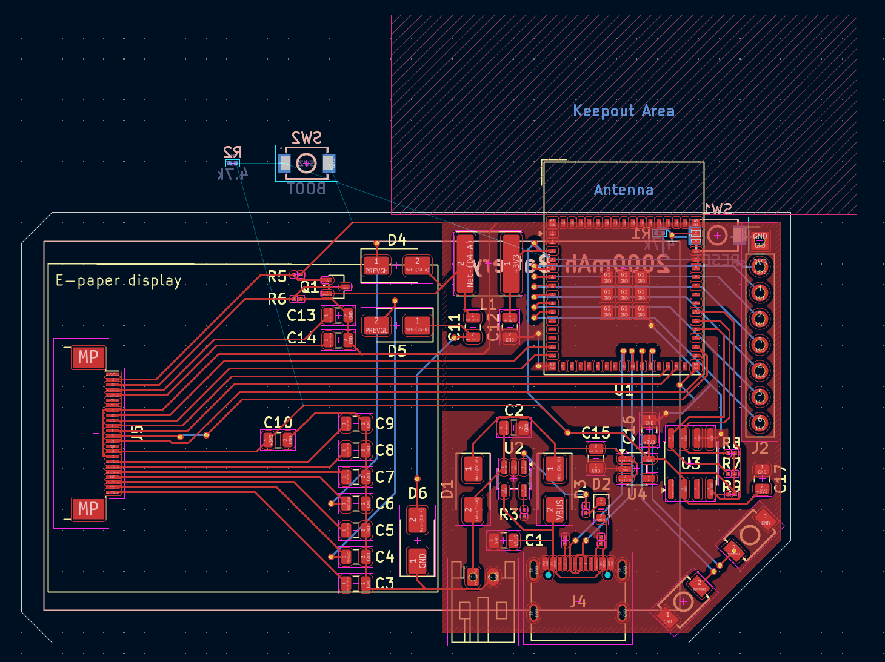

**Total time spent: 3.5 hours**

# 5/31: Squeezed that last boot button in, made some silkscreen icons

I actually got that last button in by rewiring the IO pin connections to give just enough space for it. Even then, I had to put its resistor pretty far and added 3 entire vias to deal with it because there were loads of things in the way, most prominently the battery covering 90% of the backside again. Since everything else is done now and I hopefully won't have to reload the schematic, I started renaming things, changing silkscreens, and adding icons. The IO pins were renamed for clarity and the ESP32 has its name fully written out because that looks really cool. I also added button names for those two IO buttons (that look kinda like the Game Boy ones on purpose), a lightning symbol next to the charging LED, and a silly star icon I have slapped onto like half everything I make. I really am so close to production, but I need to cover the back with silkscreens so it will look *beautiful*. 

Lapse: https://lapse.hackclub.com/timelapse/xiC5fP980MSw

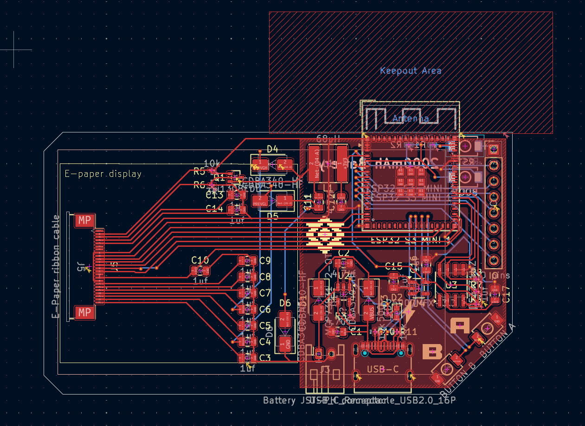

**Total time spent: 0.8 hours**

# 6/1: More silkscreen work and some extra PCB checking

I wanted to finish that PCB art but some things popped up. While checking over my circuit again and scrolling electronics shorts, I thought to check whether the LDO was supplying enough milliamps for when the ESP32 needs to access the internet, because apparently it needs upwards of 300mA for that and my current LDO could only supply 250. I switched it with another one that could handle 500mA that thankfully had the exact same footprint and pinout. I also considered thickening the power traces, but apparently they were already thick enough for my 5V and 3V3 lines. I almost forgot about connecting the ground of the BOOT button with the main pour, so I did that. Most of the work today was on the silkscreens. I added labels to all of the IO pins, recreated the backside in Affinity for design later, and added my own logo onto it. I asked the group chat of my friends, the lounge channel on the HC slack, and a Discord I was in for name ideas because I was somewhat stuck and needed one for the silkscreen art. The group chat tried naming it "tinkerbella" and "jank" (which was a good idea), the one guy on the slack agreed with one person in my group chat on "bernie" (which is the current nickname), and nobody responded on the Discord. For the final name, I settled on Neutron between that and Gearturner (by asking the other nerds in the groupchat again). I worked on the logo plenty and it went quite slowly because I'm horrible with Affinity but I don't have any other vector art softwares. I stopped at finishing the main concept and sent it to the groupchat for approval from the council. I'm going to wait until tomorrow to make a final verdict on that, because the only person who responded told me to change the font and "make it preppy" (her words). 

Lapse: https://lapse.hackclub.com/timelapse/4CGUG4vbtZhq


**Total time spent: 1 hour**

# 6/2: A lot of work on the back art and getting rid of the RTC IC

That was a pretty big one. As it turns out, I never needed the RTC IC and should've done more research beforehand, because the ESP32 I'm using already has one built in. It's not as accurate, but periodically syncing it with NTP every 12 hours will make it virtually nothing. Thus, I tossed it (and its three resistor and one capacitor lackeys) right out the window and erased it to make space for some art or something. I don't know yet. I'm asking the group chat about that. Also, more work on the silkscreen art because I want my things to look good. I finished up the logo and made most of the art on the backside, which involved going into Blender (which I am actually OK at) and messing around with outline shaders (which I am NOT OK at). It's not too complex right now but I'm looking to add details. At the moment, it's my name, the Hack Club flag, some big splash art, and the logo on the back. Next will be finishing the art on the front. I needed something to occupy my time with anyway because I'm going to ask for (peer?) review at a local makerspace on Thursday, which is also where I'm hoping to find a hotplate for soldering the microcontroller (I only have a cheap soldeirng iron from Hackpad). I should be finishing up with the silkscreens tomorrow. I have images of the front & back sides of the watch, but Kicad's 3D viewer doesn't agree with my edge cuts right now so it's just a rectangle instead of the actual shape.

Lapse: https://lapse.hackclub.com/timelapse/_bV2QoX63d5C

.png)
.png)

**Total time spent: 1.5 hours**

# 6/3: Some extra details and moving a diode

I had a bunch of summer work to do today and other activities. Just in case, I looked for things to add to the front spaces and changed the "O" in both instances of the main logo to be copper instead of silkscreen, because that looks better. I also rerouted a section of the e-paper driver to not break a silkscreen line and stay completely under the display. It looks better that way and doesn't sit on top of the outline for the screen anymore. Also removed the RTC IC from the BOM and gave it a little memorial. I'll get it reviewed tomorrow at the makerspace and hopefully also send it for Forge review. No lapse today because it was late. 

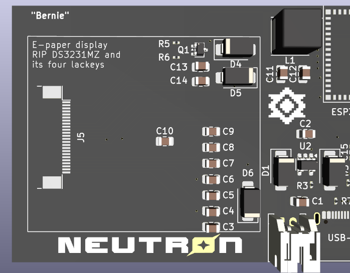

**Total time spent: 0.5 hours**

# 6/4: Fancy spaceship for back art

Yeah. I spent an entire one and a half hours modeling a fancy sci-fi spaceship for the back art because it wasn't interesting enough. I actually spent a lot of time deciding the details while yapping with my friends so that's why it took so long for it. How do I talk about it in a hardware-focused devlog?? I pretty much just made a bunch of edge loops, extruded an entire ring for the big fancy ring, extruded 4 more faces for the 4 smaller engines and making a bunch of insets for the final 5 engines. Also, I actually went to the makerspace and yapped with some guys about it (I'm can't join before I'm 18 because of their insurance things but if I get my dad to sign up for membership I get to tag along) and I learned a few things. The electronics guy there looked over my schematic and PCB and gave it the green light, so that's good. He also gave a bunch of tips on how to solder it, especially the ESP32 because I have to use a hotplate for that. Essentially what he's been doing is putting some aluminum foil in a tray in a toaster oven and then using that to reflow it. I can even do it with an old skillet I can steal from my mom! Looks like it won't be too bad. I didn't get to steal any solder wick though. Also, some guy there was making his own tri-axis 3D printer and that was super cool. Once I figure out some art for the front side I'll go send it to JLCPCB.

Lapse: https://lapse.hackclub.com/timelapse/hZlMMsgQKpJy

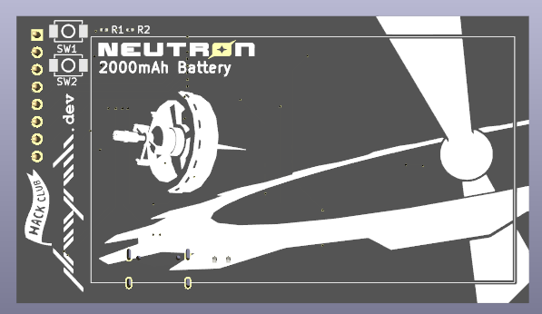

**Total time spent: 1.3 hours**

# 6/5: Getting it ready for review 

I forgot about sending it in for review before getting parts. I finished up the art on both sides and the board itself is ready. I moved the nickname to the backside, my name and credits onto the front, a soldering iron icon in the empty space left behind by the eviscerated RTC IC, and a giant Forge logo emoji underneath the e-paper screen. I was also a bit scared that I reversed the connections on the JST-PH connector for the battery, but another look showed that it was correct. I also ran DRC one last time to check for anything that would actually be an issue and it was fine asides a few thermal relief issues that I wired up anyway because I wanted to make sure that they were working right. I also updated the BOM to match my components again and put the component footprint IDs next to the parts list. The hardware section should now be done. I also thought about the firmware a bit, but personally I think that's a matter to settle for when I have hardware to test it on. I also had a problem because I did a bunch of stuff AFTER finishing the lapse, but it's fine. Also, I checked the requirements for a project for reviewing and realized that I should probably make a case and finish up the BOM properly with links. I'll do that tomorrow.

Lapse: https://lapse.hackclub.com/timelapse/REZUwnf0SyYz

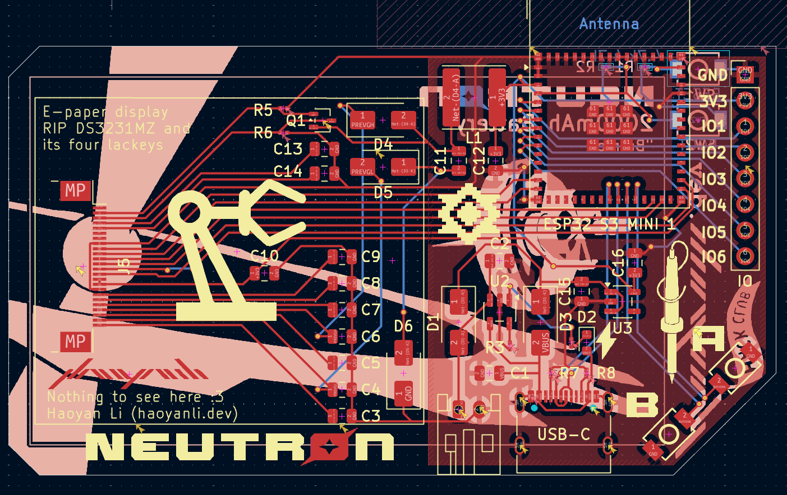

**Total time spent: 1 hour**

# 6/6: More of that getting-ready-for-review stuff and some key edits

I redid the BOM on the README and gave it links for easy access to specific parts (and to fulfill those requirements for submission). While going over every single part and finding links for them, I found that 500 ohm resistors were REALLY expensive in the 0201 format and also realized that 0201 was probably a bit too small. I do know that I can handle 0805 size parts but 0201 is literally smaller than a common ant torso and I think that's a bit much. I switched all of the resistors to 0402 instead and it's looking better now (but still tiny). That required a bit of PCB updating but it was mostly cleaning up wires and moving around parts to accomodate the slightly larger (DOUBLED IN SIZE) resistors. After that, I replaced all of the resistor links, found an 0402 500 ohm resistor that DIDN'T cost 95 cents, and finished up the BOM. I'll probably have to convert it to .csv format later but I'll worry about that sometime. I don't really know about the last couple of necessary parts (case, conformal coating for splash protection, watch band), but I'll figure them out or just make them out of scrap. I don't know how I'll document that. I also made production files (which I had to update again) to see my options for milling, and I learned that ENIG plating was how the folks who made the Orpheus Pico got the copper to look shiny (and also how most PCB designers made the pads gold for good connection). I'm considering it but it's MUCH more expensive at a $16 upcharge so I might still have it as HASL. I should have it completely ready to submit by Friday at least, as long as they're okay with me not having the firmware yet (because I'm waiting for hardware to debug it on). 

Lapse: https://lapse.hackclub.com/timelapse/KrMlffq5Bx3q

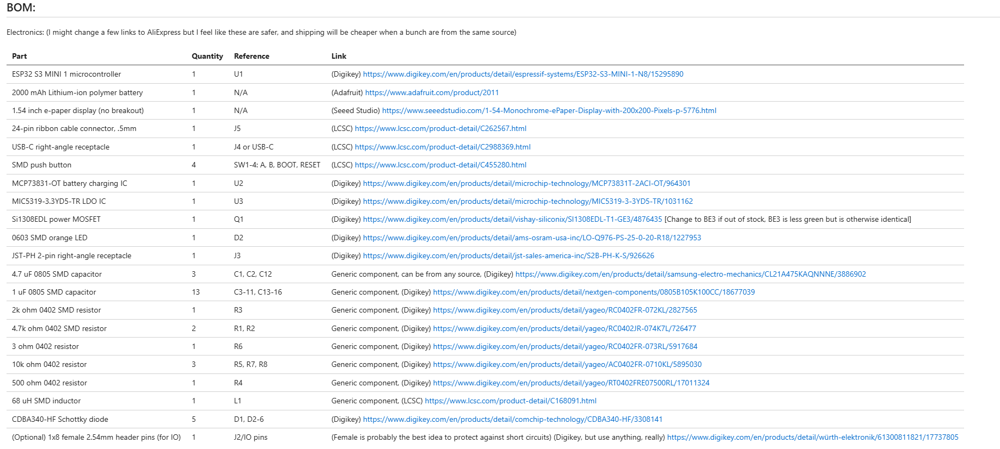

**Total time spent: 1.9 hours**

# 6/6+1: Some more work getting the thing ready for review

I was a bit concerned about the pinout of the new LDO IC in case it didn't match the earlier one (they were the same footprint and the essential pins looked the same at first glance) and the pin that didn't need connection earlier actually had a connection. However, it was optional for lower noise and I decided to skip it because I didn't want to bother with editing the schematic symbol. I also bumped my question about the firmware requirement in the forge channel on the slack. I spent some time looking for a fabric watch strap that could loop around two bars on the watch case and actually make it a watch, but most options were quite expensive because they pushed the luxury ones. I was also limited to one-piece straps, because I don't think printed PLA will hold onto the bars used for two-piece straps well. I did find a cheap one-piece strap on Amazon that I have linked in the README, and I'll try building around that for the case. I also wrote some things for the README and added a picture of the schematic to fulfill another requirement. No lapse today because I expected it to be short. The picture attatched is the full transparent schematic that's in the README. *EDIT: The image originally linked directly to the README one, but that's been updated. Here's an unused picture of the PCB that day instead.

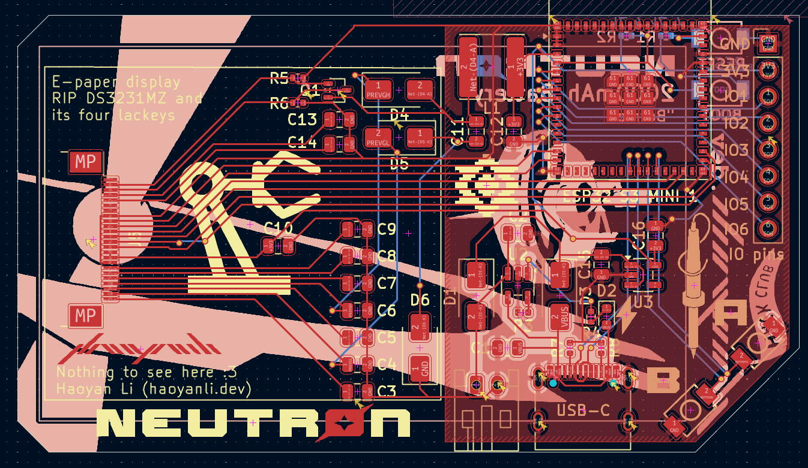

**Total time spent: 0.6 hours**

# 6/8: Just some looking around at manufacturing & submission requirements

I was occupied with work for the entire day and could only squeeze out some time at the end of the day (anything for the broken streak). I pretty much just tried PCBWay because I hoped their ENIG prices were better (they were NOT). PCBWay also had worse prices in general for fab and they had an upcharge for taking their product number off?????? I'm definitely going with JLCPCB. Also, I settled on definitely having ENIG plating because asides from the aesthetic purpose, I heard the bumps on HASL could really make soldering small SMD parts (like the 0402 resistors I'm using) and loads of tiny pins (like on the 24 pin connector) a nightmare and that the main purpose of using ENIG was to have a flatter surface. I'm also looking at stencil prices, but the biggest problem is that they apparently weigh an entire kilogram. Then I found out that the default option was 38x28cm, which is larger than a Macbook, for reference. I scaled it down to somewhat larger than my PCB (60x80mm), and prices are looking much better. No lapse today because I spent like 10 minutes. I've been thinking to myself a bit. Maybe I'm doing this in the wrong order??? I should probably finish up the firmware and case but I'm not doing the firmware until I get hardware and the case is still in progress until I have time for it. I just did this to keep my streak.

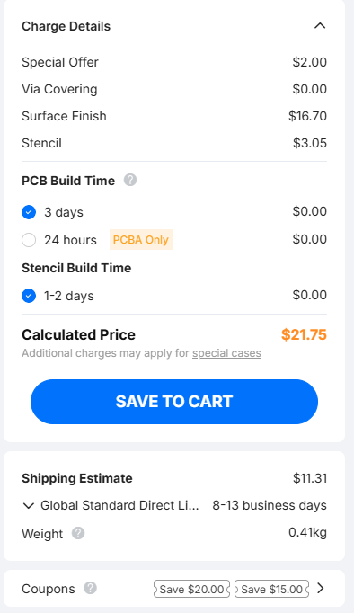

**Total time spent: 0.2 hours**

# 6/9: Adding an extra capacitor for the LDO and changing a silkscreen

More PE work so I couldn't get to make progress much. I was planning on starting the case but I was interrupted by more homework so I only got to updating my copy of FreeCAD. Instead, I edited the schematic to change C16 to 4.7uF and added C17 as a .1uF capacitor to reduce noise in the LDO (per the datasheet). The schematic image and BOM are updated to match, and the PCB is added too. I also edited the soldering iron image to take more space and also have a copper bit (preppier). I actually did ask about the firmware requirement and now I have to make a dummy firmware before submission. I think I'm going to try learning C++ to make it more effective but if all else fails, I can fall back onto CircuitPython. I was going to have a lapse today but considering how short the time got cut, I'm just going to skip it. 

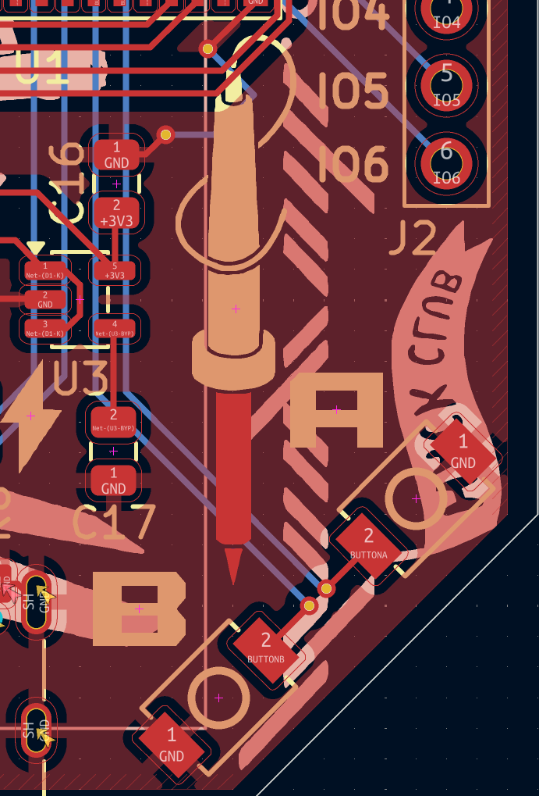

**Total time spent: 0.2 hours**

# 6/10: Replacing the LDO for a cheaper option 

I was quite shocked when I realized that the LDO was an entire $1.70!!! That's too much. I swapped it for an RT9080 that did the same thing but was cheaper and updated both the schematic and PCB to match. Again, I had a RIDICULOUS assignment today and was planning on getting to the case but couldn't. I'm thinking about skipping the case and directly adding slots for the watchband into my PCB and using double-sided-tape or something to get the battery strapped onto it. Then again, the issue of being splash-proof comes up. That's gonna be hard. I will only update the BOM because I might change the PCB again. No lapse today because that STUPID ASSIGNMENT CAME UP. Forgive me for being angry but they give us 1 day for an assignment that turned out to be 6 pages at 12 pt. font. This is a summer PE course, by the way. 


**Total time spent: 0.1 hours**

# 6/11: Modeling the case (pretty much)

Praise Isaac Newton's toenails, I finally got time off because I only had 2 assignments today. I actually got to making the case for the thing. I was initially planning on either no case or having a shell cover the entire thing, but I still wanted it to be easily removable because I put all of the silkscreen art there for a reason and I can't get injection molding for a good clear case. I initially thought of having two loops on the PCB itself and having the band go through them and between the PCB and the e-paper display, but I was afraid of damage to the components underneath and scrapped it. Plus, it's pretty hard to replace parts of a PCB that snap off. I first recreated the critical components of the PCB and components in FreeCAD, which are the battery, PCB, 8-pin connector, and e-paper screen. I had lunch after finishing that, and came up with having the watch strap go between the PCB and the battery, where there are no small components. However, I later forgot about that and instead solved the earlier PCB problem (ish) by having it friction fit into the case. This still leaves the electronics vulnerable to shorting by water, so I'll have to come up with a solution to that. I attached watch straps on the sides of the battery casing instead, because I forgot I was using a 1-piece watch strap and will have to accommodate that tomorrow. It's looking okay so far but I just have to fix that problem. I also updated the BOM images and uploaded the case files. Along the way, I also fixed a bug with the KiCad edge segments not working properly because I had a tiny segment underneath a big one and that was throwing it off. 

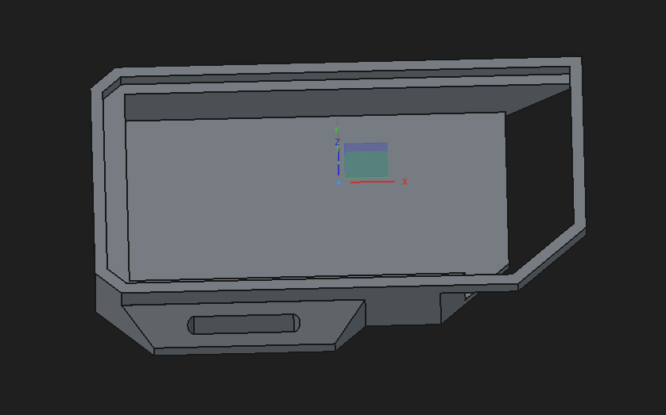

**Total time spent: 2.1 hours**

# 6/12: Changing the case a bit and attempting to redo the entire PCB

I remembered yesterday's issue about the one-piece watch band not working as well with my current loops, so I angled them 45 degrees inward so that it won't be as sharp of a bend. Also, I was looking more closely at that CircuitMess watch that was the original inspiration and realized that not only did I essentially make it worse in terms of form factor and weatherproofing, but also accidentally copied half everything including the exact microcontroller by complete accident. I felt pretty bad about it (i sat outside for a solid 20 minutes thinking about it), and decided to redo the entire e-paper circuit and power circuit to fit under the e-paper display and shrink it down some. This wasn't a great idea. I actually did rewire the entire e-paper circuit, but I realized too late that I couldn't change the actual width of the device due to the 2 power ports or sacrificing that 45-degree button space (which was one of the first things that I ever planned for it). I can't flip them onto the back side because that would prevent shrinking it due to battery size and I didn't want to switch to a different battery that could be thicker. Now I have a much more compact e-paper circuit but nothing to do with the extra space. I considered adding an LED that signaled if there was low power (by checking the voltage of the battery with like a diode with a certain forward voltage or something like that, I'm pretty bad with these). However, I scrapped that idea because if I charge the watch daily (which is what I'm planning), the estimated battery life on a full charge of over a day should easily be enough. I also realized that I never needed to change the LDO anyways, because the amperage needed for WiFi receiving is way below 250mA, and only transmitting over WiFi needed upwards of 300mA. That was stupid. More mistakes that I make by not reading closely enough. What in the world am I even doing. I think I'm just going to leave the current e-paper circuit as-is or revert to the old one, because I can't really make a meaningful change anyway. I'll think about this more once I'm thinking properly. Probably somehow related to me cutting down on sugar for PE classes this week. As for the firmware, I'm going to first make a dummy version in CircuitPython (because I can't be bothered to learn C++ at the moment) and will use that for my submission. Hopefully I'll have a mockup firmware done in 3 days and then I can submit for review. The image is the current PCB, with the background art removed because it kept catching clicks. Thinking about it now, I could probably move the USB-C port to below the display, but that means really long and convoluted paths to get power to the power-management bit. I also give up on changing the PCB image. I'm gonna change it when I'm done with the edits. 

Lapse: https://lapse.hackclub.com/timelapse/5ZasyhiRauKG

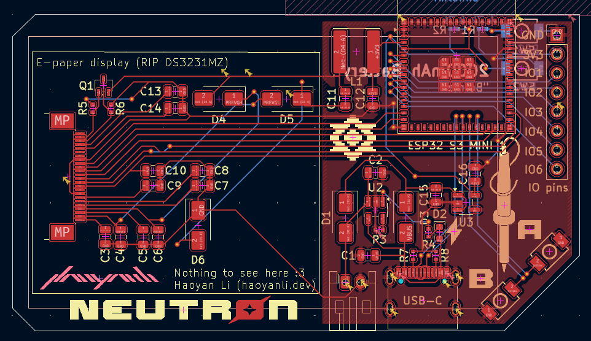

**Total time spent: 2 hours**

# 6/13: Starting the firmware and deciding to be finished with the PCB.

Remember that edit I planned yesterday? I was foiled by the battery size again. I tried looking up battery alternatives but they had either too little capacity or were the exact same size. I gave up on resizing the board and decided to keep it as-is. I did start on the firmware but I didn't get much done on it asides from just setting up the e-paper display. I'm going to make the dummy one in CircuitPython and remake it in C++ when I get a chance. Nothing actually changed for the PCB (asides from changing the fill zone and spacing out some caps), so I'll just toss in an image of what the firmware looks like now. Hopefully that's ok. I tried adding the new firmware time tracker to the existing epaper watch project but it isn't letting me. As far as I know, it's tracked exactly 10 minutes, which is pretty miserable but not too bad considering I just defined 2 variables. 

Lapse (very short and does not include programming): https://lapse.hackclub.com/timelapse/n0NHtMpKjYvQ

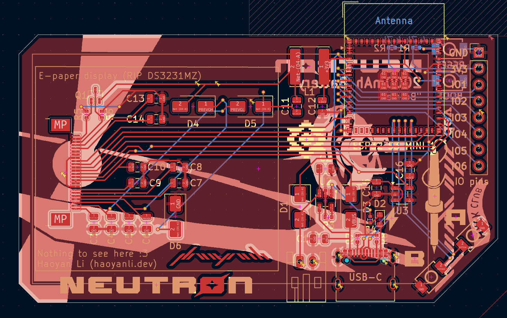

**Total time spent: 0.6 hours**

# 6/14: A bit more work on the firmware, some time testing

I tried to spend a bit more time on the firmware today. I wanted to figure out a way to (mostly) accurately track time for at least 6 hours (I'm going to sync with NTP at around that interval). I actually tried making a small program (which is also in the firmware folder) to test it with that would output what it thought the current second was but over the 40 minutes that I have tested it so far, it is about 2 seconds behind. I'm assuming that this is because it takes a small amount of time to convert the epoch time into a human-readable format, so I'm going to try using async on the next test. I'm already planning on using async for most functions in the actual script, and keeping timekeeping and display updating separate. This way, the timer hopefully will have much less lag even if it takes longer to parse the screen update. I also started reading the documentation on how displayio works, because that's the module I have to use for the e-paper display, and it looks quite powerful. No lapse because I'm tracking with Hackatime. Also, how do I even have pictures for programming? I'm just going to include a pic of the current (lagging) time test. I'll do a test with asyncio tomorrow and hopefully that'll go better. (p.s. i found that i named yesterday's files wrong. changed.)


**Total time spent: 0.5 hours**

# 6/15: Changing the height of the PCB by exactly 2 millimeters and cleaning up the mess that created

When I was looking at the PCB again, I thought that the length should be changed to make the USB-C port stick out a little more to plug in more easily with the case installed. Instead of moving it outward, I instead just pushed the bottom edge of the PCB inward 2 millimeters because I was still looking to make it smaller. For today, that's exactly what I did. Pushing the edge cuts in and re-centering the e-paper display wasn't too big of a problem asides from a few power lines getting too close for comfort and moving them apart for safety. However, changing the case model was a pain in the arse because half everything depended on a previous step and changing the size of the PCB cutout and frame triggered a domino reaction that broke almost every single element. I had to redo most of it from scratch (one of the pads was super stubborn about a missing dependency) but the case should now fit properly. After doing that and resizing the back art, I lazily tacked my icon above the display area because why not. I also tried testing that asyncio version of the timer algorithm and it's drifted like 4 seconds after an hour or so of testing. I'll try using something like time.perf_counter() to track the actual amount of time that is missed and somehow bypass that by comparing to another clock or something. If I have time, I'll get that firmware finished as soon as possible. I was going to start work on the displayio things but the 2 millimeter thing took priority for some reason. Hopefully it'll be done by the end of this week. 

Lapse: https://lapse.hackclub.com/timelapse/WHN9oUn-f7pt

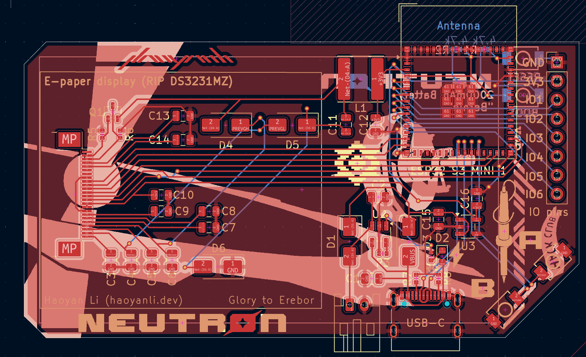

**Total time spent: 2 hours**

# 6/16: Working on accurate time

Obviously I didn't expect the timer to be perfect, but not by this much. My testing setup has changed to a 5 second or 5 minute test where the timer is looped properly, and then it uses time.monotonic() to compare tight time differences. I could multiply the final time by some amount to equal the lag created by 21600 seconds of use. A function that represents the display update is called asynchronously and prints the same message 20 times in the console. Using the normal time.sleep would lag 21 seconds after that amount, and I thought that was a bit much, so I tried to get it closer to 0. My first few tests used perf_counter, but that isn't included with CircuitPython so I scrapped it and replaced that with time.monotonic, which has pretty much the same accuracy. The first fix to that drift problem I tried was tracking the amount of time it took to execute the core loop and subtracting that from the timer. This did help some and I think I remember one of the cases leading to a final drift of .18 seconds when adjusted for 6 hours, but that was one time. I forgot to save that one or put it with version control, so it's kind of lost to the void. I also didn't want to call time.monotonic twice per minute to shave off such a small deal. I then came up with a theory of instead tracking the added time from time.sleep with time.monotonic and then adding that amount to an offset variable. This variable would then be multiplied by -1 and added to the next time.sleep, making it compensate for earlier errors. I thought this would be even better than the earlier method. I don't know why this isn't working, but I'm assuming it's just some execution order things. I've been running low on snacks and can't think properly. My current plan is instead to make an "ideal" timer which only uses whole seconds and is incremented by the amount of seconds passed. The time.monotonic after the sleep is compared to that and the resulting difference will be taken from the next time.sleep, like earlier. Hopefully this will work better. No lapse today because I'm tracking with Hackatime. I also don't really have a good image so have this picture of a recent test result.

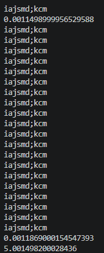

**Total time spent: 1 hour**

# 6/17: Doing that new time loop I was talking about yesterday

Well I actually got to making that new timer loop. This time, it only has to call time.monotonic() once per minute and works as a while loop. I know that a while loop can have more problems but asyncio HATES ME. The current program is exactly as I explained in the previous post but here's the commented code: 
```
ideal = time.monotonic()
offset = 0

while True:
    prev = time.monotonic()
    # Run the periodic process
    asyncio.run(display_time())
    # Sleep time with offset subtracted
    time.sleep(60 - (offset))
    # Ideal time assumes that *exactly* one second or minute has passed
    ideal += 60
    # Offset will be the difference between what the time is and what it should be. If the clock is dragging, the offset will be positive and subtracted, and if rushing it will be negative and added. 
    offset = time.monotonic() - ideal
    post = time.monotonic()
    # Print total elapsed time for debug
    print(prev - post)
```

On the latest test, the timer only drifted .0019 seconds after 5 minutes, which when multiplied to estimate the final 6 hour time, is only a drift of 0.14 seconds! 

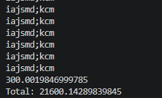

This is a small improvement over the previous best test and a massive improvement over the other ones! On the while loop, I have set it to print the amount of time that has passed between each test and I can see the times shortening or lengthening to compensate for inaccuracies. So far, it's been working really well and I think I can implement it into the main script when I get a chance. Also, I realized that 0402 resistors are STILL too small to deal with by hand. I'll swap them to 0603s and reroute tomorrow. Tracked on Hackatime again.

**Total time spent: 0.6 hours**

# 6/18: Making footprints bigger, swapping parts, calculating things, and organizing the schematic

I went back through the schematic to make the resistors all larger so that I could actually pick them up. Along the way, I also changed the resistor and capacitor footprints to their KiCAD hand-solderable variants, which had larger pads. That's definitely going to be useful. The changes caused by swapping the sizes of those weren't much asides from some nudging, but I decided to check the prices of everything again and the diodes were an entire 56 cents. That's $2.80 for 5 tiny diodes! I changed them to MBR0530T3G diodes, which are almost identical to the ones that were actually used on the Waveshare driver, the discontinued MBR0530. These diodes have a smaller SOD-123 footprint, which is much smaller than the CDBA340-HF's SMA footprint. I used this extra space to fit the larger resistor in the power circuit and give some space for everything so that I could actually work with it. I've also been thinking of organizing the schematic for a bit, and I finally figured out how to make those boxes. It's properly organized now and all sections are labelled. Taking another look at the PCB, since I have hidden the back art for the past few sessions because it got in the way, it's a bit off and doesn't line up with the battery outline anymore. That's something to do later. I really need to finish the firmware. I even planned on getting it done by tomorrow but I guess I need more time. After the back art, this should absolutely be the last revision. Also, the LCSC parts have minimum order quantities and I don't want a bunch of extra inductors and ribbon cable sockets lying around my room, so I'll have to fix that too. Also, the resistors on the back need a cutout in the case to accommodate.

Lapse: https://lapse.hackclub.com/timelapse/RpYLWTzBu84B

*Ignore the length. Lapse broke and recorded me lollygagging. I'll have that fixed ASAP. I know that I approximately spent 2:45 on it because that's what it said before I submitted.*

.png)
.png)


**Total time spent: 2.5 hours**

# 6/19: Fixing the CC pins to make it not explode, fixing the art, updating the BOM, rewiring the transistor.

More cleanup for yesterday's mess. Fixing the back art was just moving the battery outline to its correct position. The CC pin thing was actually an accident. I was going through the BOM again to fill in the correct resistor links, and mixed up the pull-up resistors on the ESP32 debug buttons with the pull-down resistors on the CC pins on the USB-C port. Apparently, I had them WAY too high and need to swap them out for 5.1K ohms instead of 10k. That's my mistake for not reading up on it. Also, I didn't pay enough attention when wiring up the transistor on the schematic, because I flipped pins 2 and 3 because the symbol on the Waveshare schematic didn't have numbers and was also mirrored. That's also my fault. Why can't I read?????? Anyway, it's fixed now, although it's kinda goofy. Fixed is better than the entire thing frying itself, I guess. This HAS to be the final PCB revision. I'm not sure if I really can afford the time to do any more. I'm still figuring out that MOQ thing for the LCSC parts but I might just suck it up and buy it at MOQ because it's astronomically cheap anyway. Also, I have no clue how to test displayio. I might have to replace the SiL1308EDL because it's nearing end-of-life. No lapse because it wasn't too long. 

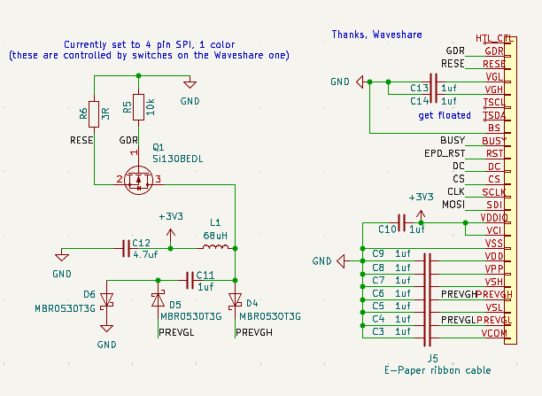

**Total time spent: 0.4 hours**

# 6/20: Fixing the case a bit and sorting the mess that is asyncio

The walls of text are probably a bit too hard to read, so I'll try adding some whitespace and seeing if it makes it more readable. 

I saw on the 18th that I needed a cutout to accomodate for two resistors on the back that I forgot earlier. Since I had to add in another pad to remove an overhang, I stuck on a chamfer that would give way for those two resistors. The case shouldn't require any more changes unless I decide that a full cover is necessary to make it splashproof. 

The MOQ issue with LCSC parts was still there, but I decided to just suck it up and put in the price for ordering that many components. With that, I shoved everything into a calculator and the final sum for all of the components (not counting the PCB) is just under $40. Not great, but much better than some other watches. Most of the cost came from the battery, so that's something I could change. Switching to a 1200mAh isn't too hard, but I don't think it's worth it for the price-power ratio. I may just look at Alibaba and see if there's a better option there. 

Most of the time today was spent working on the dummy firmware. I finished up a bit of a logic cycle concept and started tossing it together. I'm planning on having everything asynchronous so the timekeeping will run in the background and update variables/run functions to update the time. Watch "faces" will be displayio groups that are assembled on call (because I can't predefine them conveniently because you have to use the append function). The main clock will be a watch "face" that will fetch the current date, format it, and display it upon call, and the background time loop will also call a function that updates this face specifically when every minute passes. I'll use a function to switch faces instead of some dictionary because the NTP sync will be more like a function rather than a face, but can be organized along with the faces for convenience. I'm not sure how to run functions upon button presses, because I don't think event listeners (one of the few good parts of Javascript) exist in Python. I also refactored the time loop to act asynchronously, because I may have forgotten about that and shoved in a blocking loop instead.

No lapse today because most of it was tracked in Hackatime and the parts that would have been lapsed took like 15 minutes. 

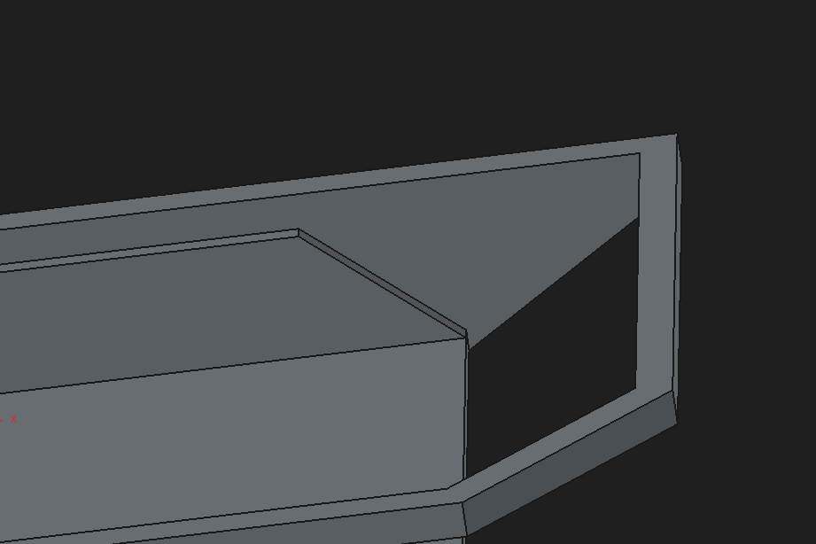

**Total time spent: 1 hour** 

# 6/21: Searching up a battery alternative

I was dragged to the beach by my family today, but I managed to squeeze some progress in while waiting for parking and in traffic jams. I thought that the final sum of $40 or so for only the components was a bit high, so I tried to find an alternative to the most expensive thing on the list, which was the battery. I wanted to keep approximately the same form factor but find something cheaper than $12.50. Finding a similarly sized battery, especially with similar thickness, was pretty hard. The most common options were 103450 batteries, which were too thick (the current battery and case when added together have a height of about 14mm, which is already quite bulky). Speaking of these things, I'm still thinking about how friggin bulky this is. 7.5x4cm is ridiculous for a watch. Either way, I ended up looking on Alibaba and somehow found a 2000mAh battery with the same dimensions as the Adafruit one (at https://www.alibaba.com/product-detail/HWE-Cheap-lipo-683566-3-7V_1601094604367.html). The only problem is that it's a 3-pin JST connector instead of a 2-pin. Apparently that third pin is for communication but can just be tied to ground sometimes. I don't really know too much about it but I'll probably keep the Adafruit battery because the Alibaba one is kind of sketchy. $1.99 is a killer deal though so I'll try buying one just for funsies. Also, a LOT of things on Alibaba have like really high minimum order quantities. I'm talking in the thousands. I didn't actually do much programming work today and it was mostly research for a short period of time, so there's no lapse. Here's a picture of the listing I was looking at. To be honest, I don't even want to make huge changes anymore. I even planned on submitting it on Friday. I just want to get this over with and make a 2.0 with all of my planned features sometime in the future and hopefully it won't be an enormous doohickey that is bad at its job like how this thing is looking to be. Isn't it funny how we often lose the most motivation when we're close to finishing?

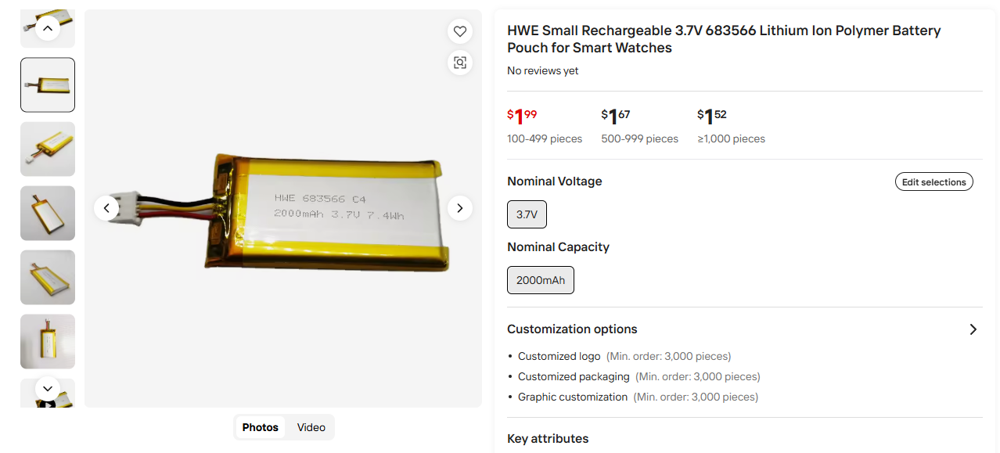

**Total time spent: 0.3 hours**

# 6/22: Just a few extra fixes

While I was on the mission to cut costs, I found that the Waveshare equivalent to the Seeed Studio screen was an entire 70 cents cheaper! Wowee! Plus, the compatibility is less of an issue here because I pretty much yoinked their driver too. I'm still looking for cheaper batteries but almost every single one is 103450. I even considered swapping to that size so I could make the PCB less wide, but that means making the watch like 16mm thick total and that would suck to wear more than it already is looking. 

I'm still working on the firmware and have decided that this firmware is solely for demonstration purposes because I'm probably going to have to reprogram it in C++ anyway because of the RAM and performance that CircuitPython uses by default. Plus, attachInterrupt looks quite convenient for tracking button presses, rather than having another endless loop. Apparently, attachInterrupt is also good for waking up devices from sleep so I could probably get away with switching to a smaller battery capacity (the 1200mAh lipo that's thinner) and just have it on sleep mode most of the time to cut down on battery usage. Considering the dummy status, I'm probably just going to shove in a bunch of nonsensical stuff in the CircuitPython script because it's a dummy anyway. I'm gonna have to scrap through C++ when I'm building it. Speaking of which, this will be the second time I learn a language out of necessity, the first being when I was forced to learn JS for the Congressional App Challenge by the resident vibecoder of our team. Hopefully removing the necessity for it to actually plausibly work should let me finish faster.

I regenerated the production files just in case, and updated the Forge thumbnail. I feel like I should be getting done with this faster so I can actually build it but I'm just steadily making slow progress. I guess I'll finish eventually. No lapse today because it was mostly on Hackatime and pretty short too. What do I even put as a picture here? I guess I can take a picture of the current Forge thing?

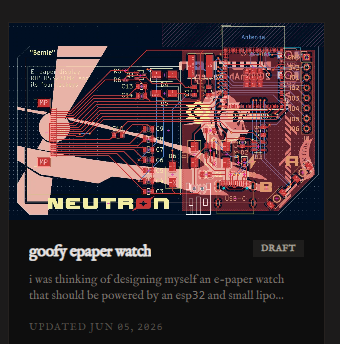

**Total time spent: 0.5 hours**

# 6/23: Wasting time

I really wanted to make progress on that firmware, so that's what I did today. Also edited the PCB again. That's like the fifth time now.

I was considering how to run actions on button presses when I both couldn't use a regular event listener or attachInterrupt in CircuitPython and also didn't want a constantly running while loop. Instead, because it's a prototype and I don't have to think as hard, I just had the main time ticking loop also check for button presses. It's literally just checking if it's pressed every second, and if the menu screen is pulled up or not. The plan is to have B open the menu from all other watch apps, while A is free for the app's functions. While on the menu, B cycles through the options and A selects one. I already have a function to cobble together the displayio group and put it on the display, so it should just run that. I only got to doing the buttons, and a bit of work on the functions again. Not much. I planned on adding NTP (that's why the settings.toml is there but blank) but didn't get to it.

While doing that I was a bit unsure about their pull so I checked the Orpheus Pico's PCB for it. While my buttons are fine, this started another thing. I was thinking about thicker power traces earlier, but seeing how FAT the Orpheus pico's VBUS and 3V3 traces are, I decided to thicken mine too. My 5v traces are now .4mm in width and 3V3 traces are .3mm. I also have this problem of the only thing connecting the ground zone of the entire main battery charging circuit being connected to the larger ground zone attached to the battery and charger by an area about 2 millimeters wide. I hope that's ok, but to be honest it probably is because plenty of circuits just have a single ground wire and it's fine??? I'm not exactly sure. Either way, the main power traces are thicker now and hopefully that'll be more stable. I also edited some silkscreens because some of my old edits disappear when I refresh the footprints, and change a part of the back silkscreen back to exposed copper because that edit got removed when I changed the height of the PCB. There used to be more silkscreen below 4 capacitors in the e-paper circuit and I squeezed their silkscreens into a hard-to-read arrangement. I moved the silkscreen elsewhere and the labels for those parts are moved to a clearer space. As usual, prod files are regenerated and photos are updated. I also forgot a case photo, so I'll shove that in. I tacked my name onto the schematic too, so that needs to be updated.

.png)

I sure do hope I'll actually finish before the end of the friggin month. I NEED to lock in on Horizons. AAAAAAAAAAAGHGHHHGHGHGHGH!!! No lapse today because it was mostly on Hackatime and the hardware bit was "too short" (I expected it to be like 10 minutes but it ended up being like 30 but it's just in the void now). Here's the picture that I'm using for the case.

.png)

**Total time spent: 1.2 hour (i dont wanna get deflated bc no lapse aughhh)**

# 6/24: And the boulder rolls back down

I did the thing again. ALL of the circuitry on the PCB scrapped. I'm changing the 2000mAh battery to 1200mAh because if I use C, I can just have it settle into sleep where it'll still running the RTC and it'll last much longer, giving me room to lower the battery capacity. I did hear that I might need to add a crystal or the RTC module again to keep it accurate because the ESP32's accurate RTC is not active during sleep. The external RTC seems easier to add, but it takes up space and is a bit expensive. The main thing is that I'm redoing the entire PCB again because I still think it's too large. The new size is 66x36mm, which is a 1cm improvement in length and 4mm in height. It could be less long but that means taking out the pin labels on the IO and that's not a great idea. The battery thickness has only gone down 1mm though, but that wasn't really too much of an issue in the first place as long as it wasn't TOO thick. I only got through rewiring the power circuit and some of the e-paper display driver, but it shouldn't be too hard and I have time tomorrow (I think). Also, to me it's kind of funny how close the resistors and capacitors in the power circuit have to be to each other but how spread out everything else is. The photo is of the current in-progress PCB. I keep forgetting that alt texts don't show up for regular viewers. My current plan is to submit this by Sunday, and then lock in so hard for Horizons that my ancestors will recoil. 

Lapse (finally): https://lapse.hackclub.com/timelapse/ulJo0iGdtniw

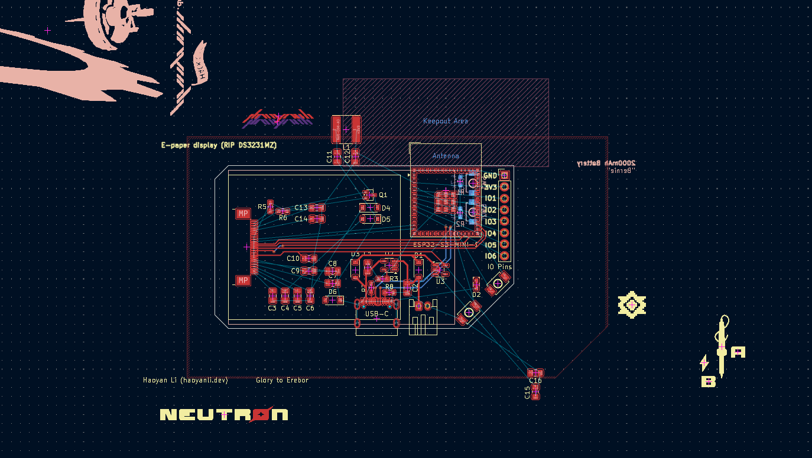

**Total time spent: 1 hour**

# 6/25: More progress on revision number... what now? Also added an oscillator.

So I did need to add a crystal. I thought it wasn't going to be too hard because SMD crystals are tiny, but they are literally the bane of my existence. Not only will they not work properlly with the smallest wrong number, but not even the datasheets will tell you what the resistor and capacitor values are. I had to dig through this 2008 guide (https://www.crystek.com/documents/appnotes/pierce-gateintroduction.pdf) which was surprisingly great and actually explained a lot about what was going on. Halfway through, I even tried to switch to an RTC IC because I hoped that it had a built-in crystal with all of the jargon sorted out but the first result on Digikey STILL NEEDED A SEPARATE OSCILLATOR. I could have gone back to the DS3231MZ/V+ but I think I just forgot about it at that time. Thanks to that PDF though, I got plausible values for the resistor and capacitors and the current set of components is smaller than the DS3231MZ with its 4 lackeys. All I need to do for the firmware is rewrite the entire thing in C and set the RTC source to the external crystal.

As for the other changes to the board, I added two extra decoupling capacitors, one to the 3V3 source and another to the RESET/EN button, because I finally found that the documentation for the ESP32 had example schematics. One of the main things I had to do to reduce space on this revision was moving the (relatively) HUMONGOUS inductor to below the microcontroller. I couldn't put it beneath the e-paper display because of its height, and it used to be squeezed between that and the MCU. It isn't too bad of a move, because a lot of the data lines for the e-paper display were moved to the other side of the PCB, giving it some space for wires on the front. I'm going to have to sacrifice some of the silkscreens, but that's fine as long as it works well at this point. Another change I made that changed it a lot was moving the USB-C receptacle to below the middle of the e-paper display, giving more breathing room for the power circuit, making it thinner, and making more space for the new arrangements. No progress on the firmware. The README and production won't be updated until this revision is done.

Lapse: https://lapse.hackclub.com/timelapse/Jt1ZnzMaKBZ0

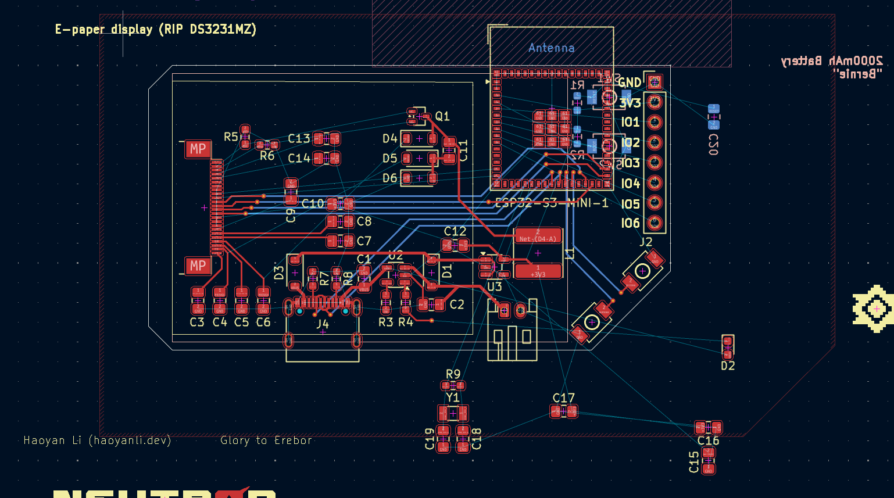

**Total time spent: 2.7 hours**

# 6/26: The summit's in sight (but not very close)

Just more wiring from the last revision. The schematic should be fine, but I'm still not sure about the crystal capacitors. I may or may not have miscalculated greatly and might need to switch to 22pF caps which won't be great. I'm still not going to update most things until the PCB is completely done and I've settled all issues. 

I had to really make a bunch of sacrifices with this revision, namely most of the background art. I moved a LOT of the traces to the back, including all of the data lines for the e-paper display. This gave me more space for the EPD power components, which I still managed to squeeze on. I found that while there was a lot of space available, it was still very cramped because of a few critical wires that couldn't be moved, like the 3V3 lines and the area dedicated to the EPD data lines. I had multiple situations where I set aside routing a part and when I do need to add it, there is no space or all of the wires are blocked off. I even had to shift all of the data lines down about 2 millimeters to squeeze in a via for the GDR and RESE pin handlers. The new capacitor on the RESET/EN button was also new and the space there was already very cramped because of the data lines and IO pin connections. To solve that, I moved the vias for the buttons from beneath the microcontroller to just outside it, also moving the DC and CS traces to accomodate. This gave enough room to move all of the IO traces downward and even more so for the top few, making them longer in exchange for getting enough space for the capacitor. I know a lot of the trace lengths aren't optimal, but they were the only way I thought of that could get enough space. One of the worst parts was forgetting about the charge indicator light, only to finish the ENTIRE REST OF THE PCB and leave it for last by accident, and I didn't want to make a via for both connections to connect it to where I want it to be. I just settled on putting it right next to the USB-C port, which is risky but it works, I guess. Adding in the crystal was surprisingly easy, because there was literally nothing where it was gonna go anyway. I don't think there really is any space for silkscreen art asides from the back now, but as long as it works it's ok. 

The lapse for yesterday was missing (forgot to paste in), so it's fixed now. I think that if I just add the NTP feature, I should be able to toss it in for review and LOCK IN FOR HORIZONSSSSS

Lapse: https://lapse.hackclub.com/timelapse/_XJ8ufc8aAVF

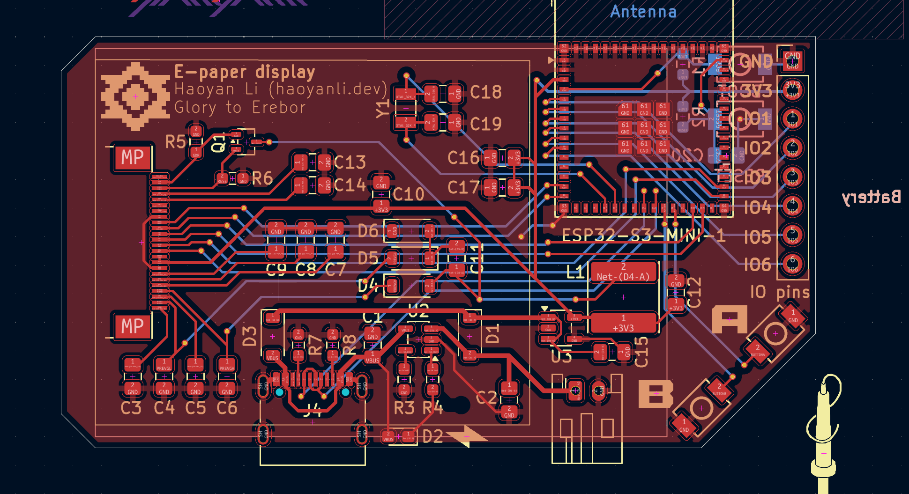

**Total time spent: 1.5 hours**

# 6/27: Just looking at the parts again

I went to the National STEM Festival today and there were loads of traffic jams, and some things came up in the afternoon on the groupchat so I didn't have a lot of time. I did get to yap to a bunch of people on Slack on the way and even got them to consider adding mini hotplates to the Forge shop. I can't really believe that the ysws orgs just happen to be other nerds like me.

So I recalculated the capacitors for the crystal and apparently on the ESP32s you don't need to factor in the diode capacitances. The capacitors are now set at 15pF assuming 5pF PCB strays, which should be OK. Also worked a bit more on the BOM and hopefully will do the case tomorrow. To be honest, I'm about ready to just shove that NTP in and then submit. No work on the PCB asides from shifting around a few silkscreens and resizing them to fit on the new PCB size. I haven't done the back art yet, though. Things to do tomorrow. Tomorrow. Tomorrow. Tomorrow.

There was going to be a lapse today but it ended up being 30 minutes of googling how to accurately guess PCB stray capacitance. 

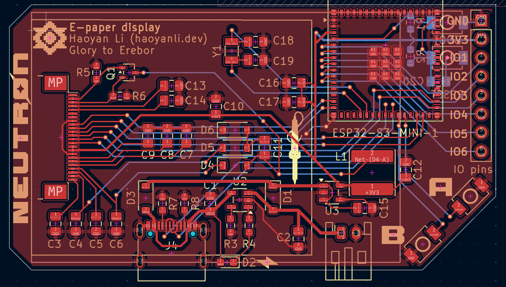

**Total time spent: 0.5 hours**

# 6/28: Final cleanups (I can almost smell completion)

Yeah just that. Asides from resizing and fixing the silkscreens to fit in the new PCB, I also redid the entire case again, with the same issues as earlier for some reason. That problem was solved the same way I did earlier, just deleting the broken step and its children and completely redoing them because they weren't too bad anyway. I'm still not sure about the crystal but hopefully someone near me has one of those books of like 5 million capacitors in case 5pF is too much for the PCB strays. I'm really trying to prep this for submission so I also locked in and did the NTP part of the firmware, which pretty much connects, syncs, and resets the time keeping variables. I think that this (untested) MVP is good enough for submission, and all I have to do is finish up the README because I forgot about that. It's been a fun ride and I can't wait to get to building... after I finish Horizons.

Lapse: https://lapse.hackclub.com/timelapse/0Dy9kjftBa4Z

.png)
.png)

**Total time spent: 1.7 hours**

# 6/29: One last round

I'm pretty must just checking everything to make sure that I can submit and it'll go through. I filled in the missing links and made sure that my part counts were right (some of them were like 1 off). The battery was also changed to be from YDL, which had a listed cost of $3. That's quite an improvement over the initial $12.50 for the 2000mAh battery I once had. I also regenerated the gerbers because I think I forgot to zip them last time. I was pretty sleepy yesterday so I forgot to put in the total time, so in it goes. Reading the submission requirements, I'm pretty sure I've checked off all of the boxes. The only thing I'm not sure about is if it's ok to have the BOM in the README instead of in a .csv, but I tossed that into #forge-help and hopefully it's ok. I'm going to log today and then hopefully get to submit tomorrow if I don't need any changes.

I don't even know what to put as the image. I guess I can shove the JLC quote in...

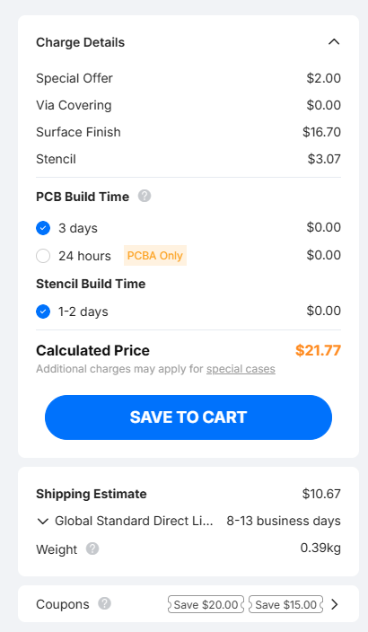

**Total time spent: 0.5 hours**

# 6/30: Forgot the BOM.csv... also added 3D models to PCB and fixed a few things that I noticed during cleanup

Nobody's on #forge-help so I just made the BOM anyway. While looking through the parts and verifying them, I found quite a few errors and fixed them along the way, which also created PCB Revision #7.1. The battery supplier I had chosen earlier had an MOQ of 4 (should've been obvious from the price) so I switched to a much more expensive Amazon equivalent (still trying to see if I can get the better deal). Since the Adafruit batteries had reversed polarity compared to most JST-PH-terminated batteries (ground on right when slot is up instead of on left), I had to reverse those on the board too. I could just disassemble the connector and reconnect in the working way, but that isn't very convenient, is it? The rest of the BOM did make sense though, and came to $57.66 without shipping, and I can assume somewhere around $20 for shipping on the good side... that isn't too good. It's still better than the watches I got inspo from, though. I also wanted to finish the 3D model of the PCB, so I used easyeda2kicad, an INCREDIBLY convenient Python tool, and dropped them in the libraries folder. It's looking pretty good! Now that I FINALLY have all of the things required for submission, I'm going to go for review. It's been a nice run!

No lapse because I assumed that it would be a matter of minutes.

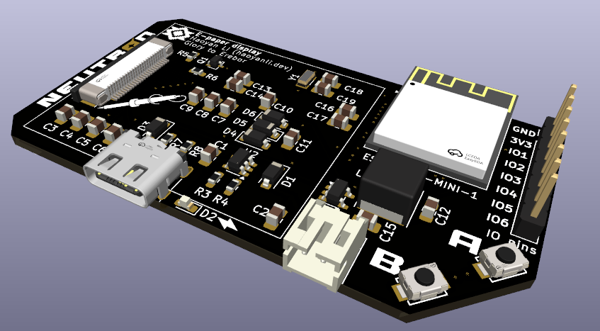

**Total time spent: 1.5 hours**

# 7/3 (Overtime): Changing the inductor to a smaller one

(This journal is written in hindsight. I expected to write it earlier but the overtime work stretched out VERY far.)

RIGHT after submitting for review, I decided to change the inductor to something that wasn't 4 millimeters tall. This involved a LOT of checking because the other e-paper boards I was using as reference used that old 68uH inductor, and I wanted a smaller one. I got a 47uH inductor instead (GoodDisplay's universal driver used one) and it shrank to 4x4mm with 1.50mm height, which was a fantastic improvement. However, I noticed afterward that the resistance was too high (around 700 mOhms) compared to the old inductor's 360 or so mOhms, which was probably dangerous (according to research). While I was deciding on how to solve this, I looked at other e-paper projects and noticed that some of them used 10uH inductors instead, and those would obviously be smaller. The Adafruit & GoodDisplay 1.54inch-specific drivers both used a 10uH inductor, so I decided to slap one from Bourns in. The footprint was also exact to the pad & didn't leave any breathing room so I expanded it manually.

The image is taken from the Lapse, because I forgot to take one on the day of.

Lapse: https://lapse.hackclub.com/timelapse/x4YiVWoyFXRB

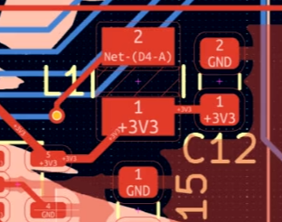

**Total time spent: 1.4 hours**

# 7/9 (Overtime): Swapping the crystal for a more reliable RTC

(This journal is written in hindsight. I expected to write it earlier but the overtime work stretched out VERY far.)

Considering how I needed this thing to be at least somewhat precise while having the ESP32 in sleep mode, I figured that guessing the PCB stray capacitance for the crystal wouldn't suffice. I decided to switch back to a dedicated RTC that would probably be better at not dropping more than a minute over 6 hours. It actually took much longer than I thought to find a suitable RTC, because most of them either were way too expensive (WHY is the DS3231 TWELVE DOLLARS) or didn't even have the built in crystal I was looking for. I decided to use the RV-3028-C7 because of its form factor, relative cheapness, and ACTUAL BUILT IN CRYSTAL. However, the documentation was harder to navigate (It didn't have an example on how the EVI pin should be connected when unused) but I fixed the schematic eventually by pulling it down through a 10k resistor. I had to dig DEEP into those datasheets because for some reason most of the example applications were in the middle of the manual.

Lapse: https://lapse.hackclub.com/timelapse/x2_YYgDoQsVR

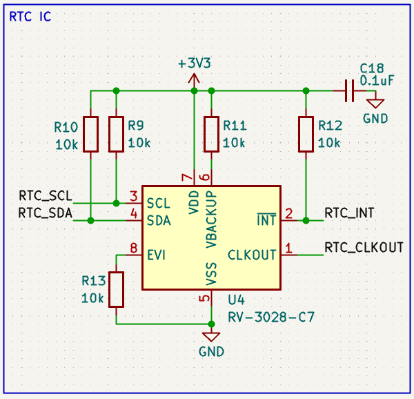

**Total time spent: 1.3 hours**

# 7/10 (Overtime): ESD to make sure the device doesn't instantly combust when I touch it

(This journal is written in hindsight. I expected to write it earlier but the overtime work stretched out VERY far.)

I decided to look at the Orpheus Pico again as an example, and found an ESD diode array in there. Curious about it, I googled it and it turns out THAT is what's necessary to prevent the board from immediately exploding if I touch it with static??? Since it was a wearable and would face contact often, I made the good decision of deciding to add ESD. The USBLC6-2SC6 wasn't hard to implement, but I spent too much time looking for a cheaper alternative. I also rearranged the schematic to fit it alongside the other USB-C specific components. I also made one of the few original decisions completely authored by me in this project: adding an ESD Zener diode to the battery power line, but I didn't get to that here. Mostly just looking for alternatives to the USBLC6-2SC6.

Lapse: https://lapse.hackclub.com/timelapse/r3k0T5DgpitV

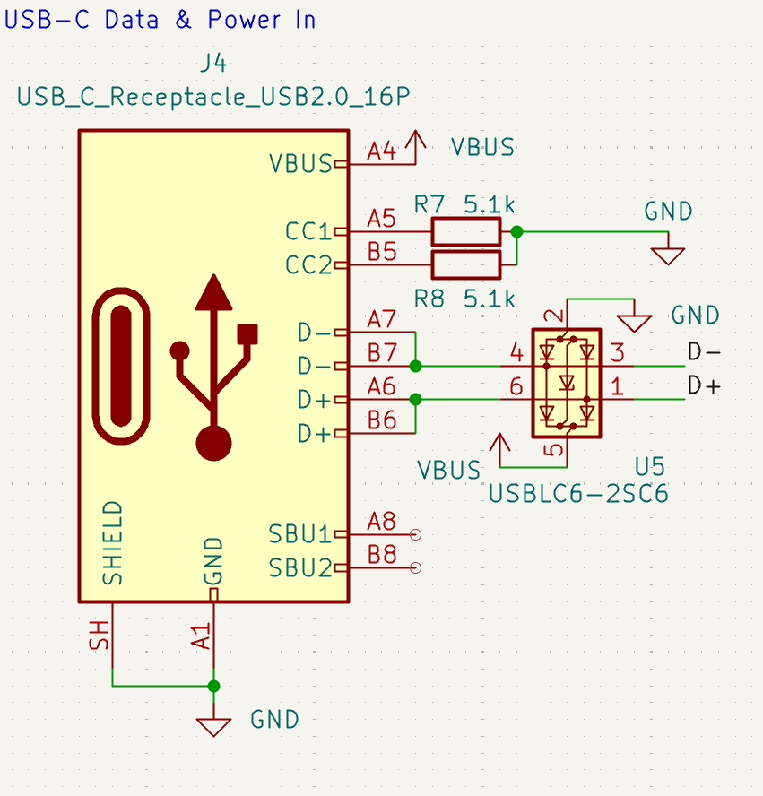

**Total time spent: 0.5 hours**

# 7/14 (Overtime): Rerouting the PCB and messing around with that Zener diode

(This journal was actually written on the day of.)

Since I thought all of the schematic edits were done, I got to rerouting the entire PCB. The first thing I did was sticking the USB ESD in, and I had to move the trace used for the two diode power supply switching to the back of the PCB. I actually decided to flip it around to put the VBUS pin closer to the receptacle for easier connection. To bridge a few gaps between ground sources, I also added a ground plane to the back. I was initially going to use dedicated traces for that, but this seemed useful anyway. The stitching vias aren't very packed together but it should work. The power indication diode was on the other side for some reason, so I fixed that and could now remove the extra two vias because the back ground plane now connects the split in the front ground plane created by the LED traces. The Zener ESD diode for the battery was a bit hard to manage. Most of the options I saw on Digikey were EXTREMELY small, at 0201 scale. Obviously, I can't place that by hand so I dug for a suitable 0603 alternative, which I found in the GG0603052R542P by Kyocera AVX. This didn't have a built-in symbol, but since it used a common footprint I could just rename an existing bidirectional TVS diode symbol and reassign its footprint. I was quite concerned about the 16V clamping voltage, which would probably allow high voltages to completely fry my circuit. However, I wasn't nearly as concerned after seeing that the USBLC6-2SC6 had a 17V clamping voltage and it was fine. The RTC IC wasn't actually that hard to route because I just reused the traces from the crystal and used vias to the backside for the lines that needed pullup resistors. Also I found these symbols that come with KiCAD and added the smallest of the OSHW logos to the board because that's technically what it is. There was also two easter eggs in the folder (an actual easter egg and a small Blahaj) that I added to the corner of the PCB for fun. I am almost 100% sure that the thing is done now and I really just wanna finish it. 

Lapse: https://lapse.hackclub.com/timelapse/BXUD6wvWUGcE

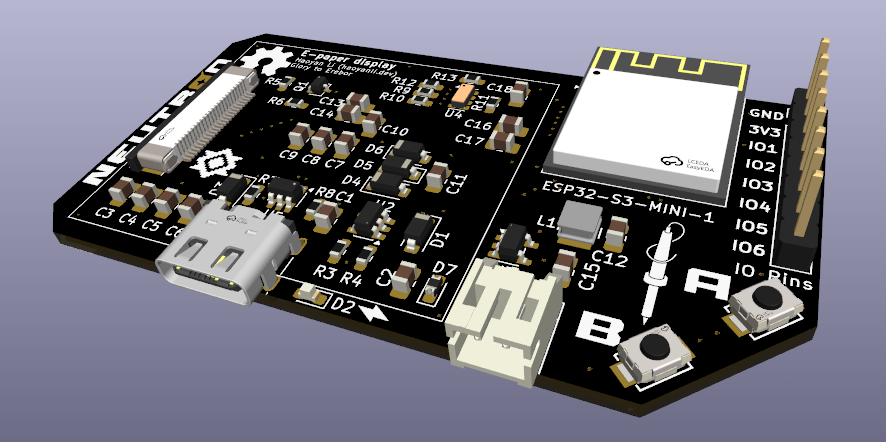

**Total time spent: 2 hours**