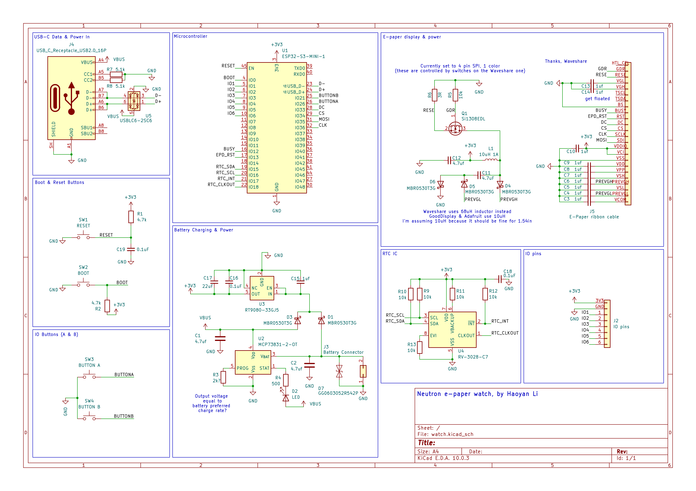
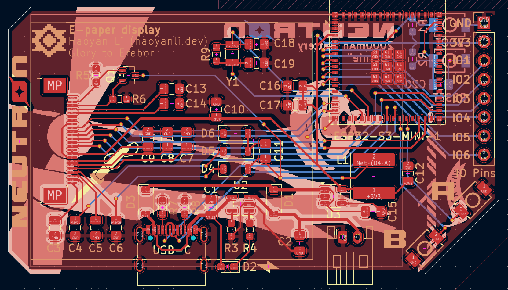
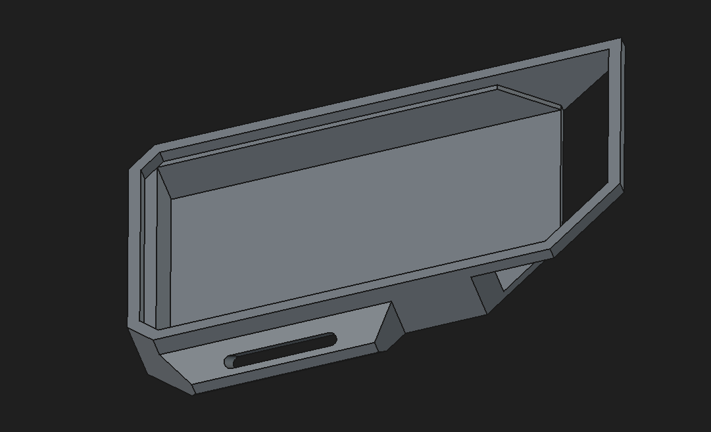

# Neutron e-paper watch

A developer/tech nerd friendly wristwatch powered by an ESP32 S3 MINI 1, uses an e-paper display for power efficiency, and a 2000mAh battery for all-day use. It's supposed to provide both the features that a regular watch is supposed to have, while also having smartwatch functions and IO pins to leverage the power of the ESP32 microcontroller. I really wanted to make myself a wristwatch that I could use and carry around in everyday life. I was initially inspired by that really expensive and prebuilt CircuitMess watch, but it lacked the DIY process and developer tools that I wanted (so no PineTime from Flavortown either). I also was bored and wanted to make another hardware project after Hackpad, and I started noticing how much I needed a watch because I got used to borrowing my mom's and forgetting the time afterward. Plus, it just looks cool. The e-paper screen was added for the power advantage over OLED, not drawing power asides from time changes. It made the driver bit more complex (because I didn't want to occupy more space with a drop-in driver module), but might have some orientation issues. The battery was initially going to be 500mAh, but that was much too little and I chose a much larger battery to carry a charge that should last all day at the cost of more space. I think that this will be a rewarding project and a well-functioning timepiece, but that will be settled after I order. 

Current features: 
- 1.54 inch e-paper display
- 2000 mAh Li-po battery which will give around 15-20 hours of battery life (hopefully), orange LED charging indicator
- USB-C charging and data transfer
- ESP32 S3 MINI 1 powered, so it has internect connectivity
- Automatically syncs time with NTP every 12 hours (planned in firmware)
- 8-pin female IO pin row, with 1 ground, 1 3.3v, and 6 IO pins.
- 2 IO buttons, labeled A and B in the style of the Game Boy
- Reset and boot buttons for programming
- Hopefully won't explode (IMPORTANT)

Firmware is currently untested (asides from the timekeeping loop) and is only there for submission purposes. It is currently in CircuitPython but I will probably rewrite it in C at one point.

Assembly notes (so far): Snip off legs on JST-PH receptacle after soldering, apply Kapton tape to the side of the battery that will lie in contact with the board, apply Kapton tape to backside of e-paper screen, use DOUBLE SIDED FOAM TAPE???

## Schematic (image outdated, will be updated once complete due to frequent revisions)

## PCB (image outdated, will be updated once complete due to frequent revisions)
Note: the PCB is 75x40mm

## Case (image outdated, will be updated once complete due to frequent revisions)

## BOM:

### Note: outdated, resistors need to be updated to 0603 links
Electronics: (I might change a few links to AliExpress but I feel like these are safer, and shipping will be cheaper when a bunch are from the same source)
|Part|Quantity|Reference|Link|Price per unit (as of completion)|Price for all of part, including bulk ordering discounts|
|---|---|---|---|---|---|
|ESP32-S3-MINI-1-N8 microcontroller|1|U1|(LCSC) https://www.lcsc.com/product-detail/C2913206.html|$4.73|$4.73|
|1200 mAh Lithium-ion polymer battery|1|N/A| (Adafruit, use Digikey if out of stock) https://www.adafruit.com/product/258|$9.95|$9.95|
|1.54 inch e-paper display (no breakout)|1|N/A| (Waveshare) https://www.waveshare.com/product/1.54inch-e-paper.htm|$5.99|$5.99|
|24-pin ribbon cable connector, .5mm|1|J5| (LCSC) https://www.lcsc.com/product-detail/C262567.html|$0.13|$0.65*|
|USB-C right-angle receptacle|1|J4 or USB-C| (LCSC) https://www.lcsc.com/product-detail/C2988369.html|$0.09|$0.44*|
|SMD push button|4|SW1-4: A, B, BOOT, RESET| (LCSC) https://www.lcsc.com/product-detail/C455280.html|$0.06|$0.63*|
|MCP73831-OT battery charging IC|1|U2| (Digikey) https://www.digikey.com/en/products/detail/microchip-technology/MCP73831T-2ACI-OT/964301|$0.76|$0.76|
|RT9080-33GJ5 LDO IC|1|U3| (Digikey) https://www.digikey.com/en/products/detail/richtek-usa-inc/RT9080-33GJ5/6161634|$0.28|$0.28|
|Si1308EDL N-channel MOSFET|1|Q1| (Digikey) https://www.digikey.com/en/products/detail/vishay-siliconix/SI1308EDL-T1-GE3/4876435 [Change to BE3 if out of stock]|$0.62|$0.62|
|0603 SMD orange LED|1|D2| (Digikey) https://www.digikey.com/en/products/detail/ams-osram-usa-inc/LO-Q976-PS-25-0-20-R18/1227953|$0.14|$0.14|
|JST-PH 2-pin right-angle receptacle|1|J3| (Digikey) https://www.digikey.com/en/products/detail/jst-sales-america-inc/S2B-PH-K-S/926626|$0.11|$0.11|
|4.7 uF 0805 SMD capacitor|4|C1, C2, C12, C16| Generic component, can be from any source, (Digikey) https://www.digikey.com/en/products/detail/samsung-electro-mechanics/CL21A475KAQNNNE/3886902|$0.11|$0.44|
|1 uF 0805 SMD capacitor|12|C3-11, C13-15| Generic component, (Digikey) https://www.digikey.com/en/products/detail/samsung-electro-mechanics/CL21B105KAFNNNE/3886724|$0.10|$0.59|
|0.1 uF 0805 SMD capacitor|1|C17| Generic component, (Digikey) https://www.digikey.com/en/products/detail/samsung-electro-mechanics/CL21B104KBCNNNC/3886661|$0.10|$0.10|
|2k ohm 0603 SMD resistor|1|R3| Generic component, (Digikey) https://www.digikey.com/en/products/detail/panasonic-industry/ERJ-3EKF2001V/196183|$0.10|$0.10|
|4.7k ohm 0603 SMD resistor|2|R1, R2| Generic component, (Digikey) https://www.digikey.com/en/products/detail/stackpole-electronics-inc/RMCF0603FT4K70/1760998|$0.10|$0.20|
|3 ohm 0603 resistor|1|R6| Generic component, (Digikey) https://www.digikey.com/en/products/detail/panasonic-industry/ERJ-3GEYJ3R0V/282122|$0.10|$0.10|
|10k ohm 0603 resistor|1|R5| Generic component, (Digikey) https://www.digikey.com/en/products/detail/yageo/RC0603FR-0710KL/726880|$0.10|$0.10|
|5.1k ohm 0603 resistor|2|R7, R8| Generic component, (Digikey) https://www.digikey.com/en/products/detail/yageo/RC0603FR-075K1L/727268|$0.10|$0.20|
|500 ohm 0603 resistor|1|R4| Generic component, (Digikey) https://www.digikey.com/en/products/detail/yageo/RT0603BRD07500RL/17019950|$0.10|$0.10|
|68 uH SMD inductor|1|L1| Generic component, (LCSC) https://www.lcsc.com/product-detail/C168091.html|$0.11|$1.13|
|MBR0530T3G Schottky diode|5|D1, D2-6| (Digikey) https://www.digikey.com/en/products/detail/onsemi/MBR0530T3G/1477144|$0.29|$1.45|
|(Optional) 1x8 female 2.54mm header pins, preferably low profile (for IO)|1|J2/IO pins| (Female is probably the best idea to protect against short circuits) (Digikey, but use anything, really) https://www.digikey.com/en/products/detail/sullins-connector-solutions/NPPN081BFCN-RC/804810|$0.85??????????????|

It's probably a good idea to order 1-2 extra of the resistors, capacitors, and diodes. 

*LCSC parts have a minimum order quantity, which means that you can't order less than a certain amount because that's too hard to handle. This means that extras will come with certain parts. The MOQ for most LCSC parts is 5 components, except the buttons and the inductors, which have an MOQ of 10, and the ESP32 itself which has an MOQ of 1. I don't know how to order under that amount.

Non-electronics:
- 3D-printed case
- One-piece 16mm fabric watch strap (Amazon - https://www.amazon.com/WOCCI-Military-One-piece-Ballistic-Buckle/dp/B0CTT8C1JG?th=1)??
- (Optional but probably needed) PCB coating for waterproofing 
- Kapton tape for electronic insulation and protecting some components

## Credits:

yassin for looking over my battery circuit and pointing out that I tried to shove 5v into 3v3 (I know I'm an idiot)
Kai Pereira for responding to my questions on the hardware slack and for his Overglade badge which I used as a bit of a reference to make sure I'm not doing anything stupid with the e-paper
Waveshare for their e-paper driver (pretty much dropped in the entire schematic for that, do NOT give me any credit for that) (I cannot stress enough that all credit should go to them because I literally do not know anything about e-paper displays. Heck, the entire project is literally like 3 example schematics that are wired together in a way that looks like it works. I hope I know what I'm doing and I will binge a BUNCH of high-school-level electronics courses afterward.)
The OCGC Google Chat (a bunch of my friends) for name help